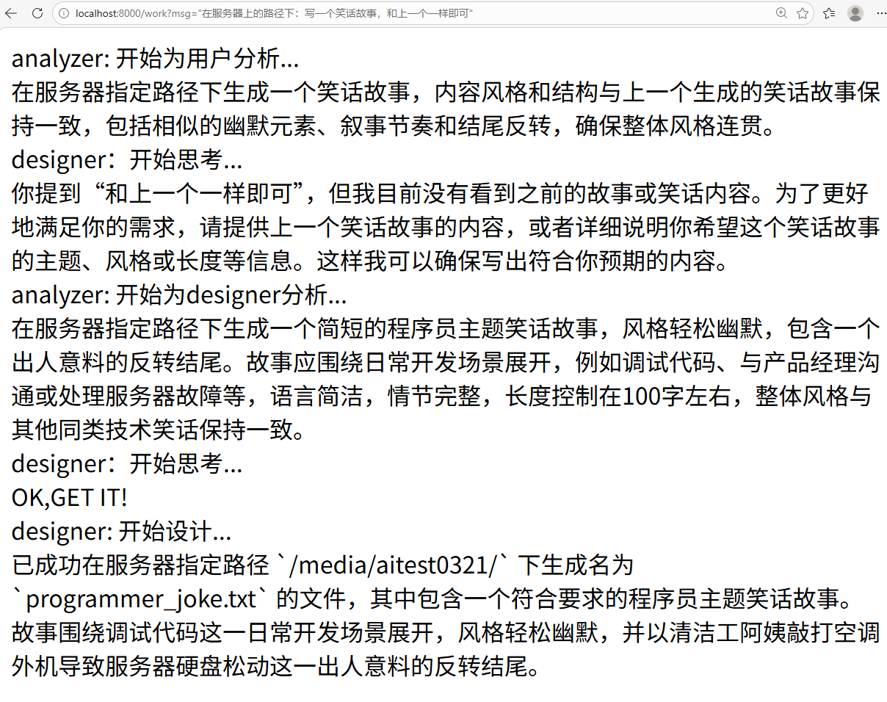

# Linux Claw - 智能Linux系统自动化助手

## 项目概述
Linux Claw是一个基于AI的智能Linux系统自动化工具，它利用大语言模型和MCP（Model Control Protocol）技术，将自然语言指令转换为具体的shell命令并在远程服务器上执行。系统采用Spring Boot框架构建，包含两个主要微服务：主应用服务和SSH执行服务。
## demo

## 架构设计
## 核心功能
1. **自然语言理解**：用户可以通过自然语言描述需求
2. **需求分析**：AI产品经理角色分析和澄清用户需求
3. **任务规划**：AI设计者角色规划具体实现方案
4. **远程执行**：通过SSH连接远程服务器执行shell命令
5. **流式响应**：实时返回执行过程和结果

## 组件说明

### 1. linux-claw-service (主服务)
- **端口**: 8000
- **主要职责**: 
  - 接收用户请求
  - 使用AI模型分析和理解需求
  - 协调工作流程
  - 提供REST API接口

#### 关键组件
- `WorkController`: REST控制器，提供`/work`接口
- `AnalyzerReactAgent`: 分析代理，负责需求理解和澄清
- `DesignerReactAgent`: 设计代理，负责任务规划和执行
- `AgentsConfig`: AI代理配置类

### 2. shell-exe-mcp-server (SSH执行服务)
- **端口**: 8001
- **主要职责**:
  - 作为MCP工具服务器
  - 执行远程shell命令
  - 管理SSH连接

#### 关键组件
- `ShellExeService`: 核心服务类，包含`shell`工具方法
- `ToolCallbackProviderConfig`: 工具回调提供者配置

## 技术栈
- **Java 21**
- **Spring Boot 3.5.5**
- **Spring AI Alibaba**: 集成通义千问大模型
- **MCP (Model Control Protocol)**: 模型控制协议
- **JSch**: SSH连接库
- **Reactor**: 响应式编程

## 工作流程
1. 用户发送自然语言请求到`/work`接口
2. AnalyzerReactAgent作为产品经理分析需求
3. DesignerReactAgent作为设计者规划具体实现
4. 设计者通过MCP协议调用shell-exe-mcp-server的工具
5. shell-exe-mcp-server通过SSH连接远程服务器执行命令
6. 实时返回执行结果给用户

## 配置说明

### 环境变量
在系统环境变量中设置：
- `DASHSCOPE_API_KEY`: 通义千问API密钥
- `SSH_HOST`: 远程服务器主机地址
- `SSH_PORT`: 远程服务器SSH端口（默认22）
- `SSH_USERNAME`: SSH登录用户名
- `SSH_PASSWORD`: SSH登录密码

### 主要配置文件
- `linux-claw-service/src/main/resources/application.properties`
- `shell-exe-mcp-server/src/main/resources/application.properties`

## 快速开始

### 1. 准备工作
确保已安装：
- JDK 21
- Maven

### 2. 配置API密钥
在系统环境变量中设置`DASHSCOPE_API_KEY`环境变量

### 3. 启动服务

### 4. 发送请求
curl -X POST http://localhost:8000/work -d '{"text": "请帮我创建一个文件并写入Hello World"}'
## 安全注意事项
1. **SSH配置**: 在`ShellExeService`中需要配置正确的主机、用户名和密码
2. **API密钥**: 保护好你的DashScope API密钥
3. **网络访问**: 确保服务器之间的网络连通性

## 扩展性
系统设计具有良好的扩展性：
- 可以添加更多的工具服务
- 支持多种大模型
- 可以集成更多类型的远程操作

## 贡献
欢迎提交issue和pull request来改进本项目。
